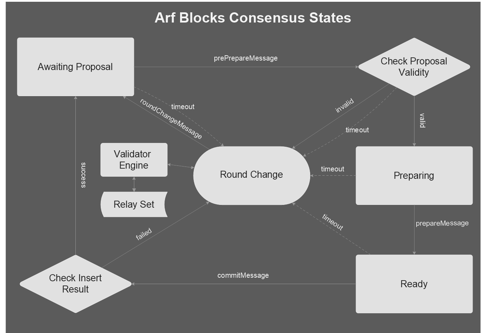

# 

## ArfBlocks

ArfBlocks is an ethereum based blockchain (clone of go-ethereum) with unique features and new consensus mechanism which is inspired by clique, tendermint and ibft. 

Key enhancements:

 * #### New Architecture Design 
 * #### Alternative Consensus
 * #### Node Permissioning (Secure Nodes)
 * #### Higher Performance 
 * #### Code Samples in Common Languages 
 * #### Ready-to-Use Smart Contract Templates

WARNING: ArfBlocks is under VERY ACTIVE DEVELOPMENT and cannot be run properly. This means it is not meant to be run in production. Its documentations, codes and APIs are subject to change without warning and should not be relied upon, and it should not be used to hold any value. We will remove this warning after our first release that is tested, stable and secure.

## Architecture
# 

## Consensus
# 

## Building the source

Building goArf requires both a Go (version 1.7 or later) and a C compiler.
You can install them using your favourite package manager.
Once the dependencies are installed, run

    make goArf

or, to build the full suite of utilities:

    make all

## How to run goArf

Running goArf is similar to running the POA nodes in ethereum chain.


#### Defining the private genesis state

First, you'll need to create the genesis state of your networks, which all nodes need to be aware of
and agree upon. This consists of a small JSON file (e.g. call it `genesis.json`):

```json
{
    "config": {
        "chainId": 0,
        "homesteadBlock": 0,
        "eip150Block": 0,
        "eip150Hash": "0x0000000000000000000000000000000000000000000000000000000000000000",
        "eip155Block": 0,
        "eip158Block": 0,
        "arfist": {
            "epoch": 30000,
            "policy": 0
        }
    },
    "nonce": "0x0",
    "timestamp": "0x00",
    "extraData": "0x0000000000000000000000000000000000000000000000000000000000000000000000000000000000000000000000000000000000000000000000000000000000000000000000000000000000000000000000000000000000000000000000000000000000000000000000000000000000000000000000000000000000000000000000000000000000000000000000000000000000000000000000000000000000000000000000000000000000000000000000000000000000000000",
    "gasLimit": "0x47b760",
    "difficulty": "0x1",
    "mixHash": "0x0000000000000000000000000000000000000000000000000000000000000000",
    "coinbase": "0x0000000000000000000000000000000000000000",
    "number": "0x0",
    "gasUsed": "0x0",
    "parentHash": "0x0000000000000000000000000000000000000000000000000000000000000000"
}
```

The above fields should be fine for most purposes, although we'd recommend changing the `nonce` to
some random value so you prevent unknown remote nodes from being able to connect to you. If you'd
like to pre-fund some accounts for easier testing, you can populate the `alloc` field with account
configs:

```json
    "alloc": {
        "0000000000000000000000000000000000000001": {
            "balance": "0x446c3b15f9926687d2c40534fdb564000000000000"
        },
        "0000000000000000000000000000000000000002": {
            "balance": "0x446c3b15f9926687d2c40534fdb564000000000000"
        },
        "0000000000000000000000000000000000000003": {
            "balance": "0x446c3b15f9926687d2c40534fdb564000000000000"
        },
        "0000000000000000000000000000000000000004": {
            "balance": "0x446c3b15f9926687d2c40534fdb564000000000000"
        }
    }
```

With the genesis state defined in the above JSON file, you'll need to initialize **every** goArf node
with it prior to starting it up to ensure all blockchain parameters are correctly set:

```
$ goArf init path/to/genesis.json
```

### Programatically interfacing goArf nodes

As a developer, sooner rather than later you'll want to start interacting with goArf and the Ethereum
network via your own programs and not manually through the console. To aid this, goArf has built in
support for a JSON-RPC based APIs. These can be exposed via HTTP, WebSockets and IPC (unix sockets on unix based platforms, and named pipes on Windows).

The IPC interface is enabled by default and exposes all the APIs supported by goArf, whereas the HTTP
and WS interfaces need to manually be enabled and only expose a subset of APIs due to security reasons.
These can be turned on/off and configured as you'd expect.

HTTP based JSON-RPC API options:

  * `--rpc` Enable the HTTP-RPC server
  * `--rpcaddr` HTTP-RPC server listening interface (default: "localhost")
  * `--rpcport` HTTP-RPC server listening port (default: 8545)
  * `--rpcapi` API's offered over the HTTP-RPC interface (default: "eth,net,web3")
  * `--rpccorsdomain` Comma separated list of domains from which to accept cross origin requests (browser enforced)
  * `--ws` Enable the WS-RPC server
  * `--wsaddr` WS-RPC server listening interface (default: "localhost")
  * `--wsport` WS-RPC server listening port (default: 8546)
  * `--wsapi` API's offered over the WS-RPC interface (default: "eth,net,web3")
  * `--wsorigins` Origins from which to accept websockets requests
  * `--ipcdisable` Disable the IPC-RPC server
  * `--ipcapi` API's offered over the IPC-RPC interface (default: "admin,debug,eth,miner,net,personal,shh,txpool,web3")
  * `--ipcpath` Filename for IPC socket/pipe within the datadir (explicit paths escape it)

You'll need to use your own programming environments' capabilities (libraries, tools, etc) to connect
via HTTP, WS or IPC to a goArf node configured with the above flags and you'll need to speak [JSON-RPC](http://www.jsonrpc.org/specification)
on all transports. You can reuse the same connection for multiple requests!

**Note: Please understand the security implications of opening up an HTTP/WS based transport before
doing so! Hackers on the internet are actively trying to subvert Ethereum nodes with exposed APIs!
Further, all browser tabs can access locally running webservers, so malicious webpages could try to
subvert locally available APIs!**

#### Creating the rendezvous point

With all nodes that you want to run initialized to the desired genesis state, you'll need to start a
bootstrap node that others can use to find each other in your network and/or over the internet. The
clean way is to configure and run a dedicated bootnode:

```
$ bootnode --genkey=boot.key
$ bootnode --nodekey=boot.key
```

With the bootnode online, it will display an [`enode` URL] 
that other nodes can use to connect to it and exchange peer information. Make sure to replace the
displayed IP address information (most probably `[::]`) with your externally accessible IP to get the
actual `enode` URL.

*Note: You could also use a full fledged goArf node as a bootnode, but it's the less recommended way.*

#### Starting up your member nodes

With the bootnode operational and externally reachable (you can try `telnet <ip> <port>` to ensure
it's indeed reachable), start every subsequent goArf node pointed to the bootnode for peer discovery
via the `--bootnodes` flag. It will probably also be desirable to keep the data directory of your
private network separated, so do also specify a custom `--datadir` flag.

```
$ goArf --datadir=path/to/custom/data/folder --bootnodes=<bootnode-enode-url-from-above>
```

*Note: Since your network will be completely cut off from the main and test networks, you'll also
need to configure a miner to process transactions and create new blocks for you.*


